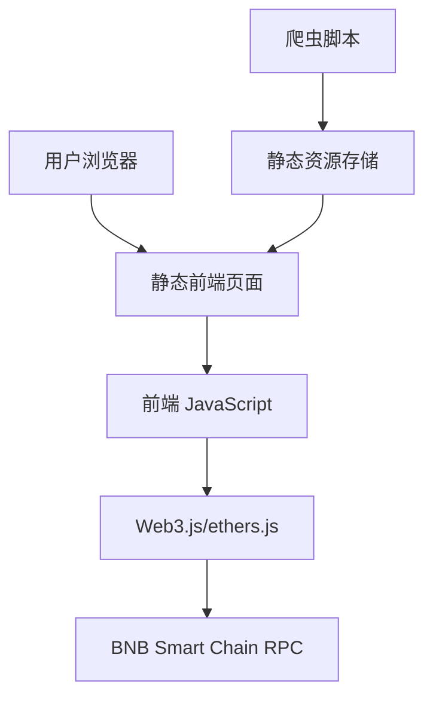

# 设计文档

## 概述

EVO Payment 收银台是一个基于 Web 的稳定币支付解决方案，通过爬取和复刻 imsafu 网站来实现像素级的用户界面，并集成 BNB Smart Chain 区块链支付监听功能。系统采用前端静态页面 + 后端 API 的架构，支持实时交易监听和自动支付确认。

## 架构

### 整体架构



### 技术栈

- **前端**: HTML5, CSS3, JavaScript (ES6+), 响应式设计
- **区块链交互**: Web3.js 或 ethers.js (纯前端实现)
- **爬虫**: Node.js + Puppeteer (简单脚本)
- **部署**: 纯静态文件服务 (无需后端服务器)

## 组件和接口

### 1. 爬虫组件 (Scraper Component)

**职责**: 爬取 imsafu 网站的所有页面和资源

**核心功能**:
- 页面内容爬取 (HTML/CSS/JS)
- 静态资源下载 (图片、字体等)
- 页面交互流程分析
- 资源路径映射和修复

**接口**:
```javascript
class WebScraper {
  async scrapeHomePage(url)
  async scrapePaymentFlow(startUrl)
  async downloadAssets(assetUrls)
  async saveToDirectory(content, targetDir)
}
```

### 2. 页面复刻组件 (Page Replication Component)

**职责**: 将爬取的内容转换为 EVO Payment 品牌页面

**核心功能**:
- 品牌文字替换 (imsafu → EVO Payment)
- 图片资源替换
- 样式调整和优化
- 交互逻辑保持

**接口**:
```javascript
class BrandReplacer {
  async replaceTextContent(htmlContent, replacements)
  async replaceImages(htmlContent, imageMap)
  async updateStyles(cssContent, brandColors)
  async preserveInteractions(jsContent)
}
```

### 3. 支付处理组件 (Payment Handler Component)

**职责**: 处理支付请求和生成支付信息 (纯前端实现)

**核心功能**:
- 生成支付地址和二维码
- 在内存中管理支付状态
- 生成唯一支付标识

**接口**:
```javascript
class PaymentHandler {
  generatePaymentId()
  generateQRCode(paymentAddress, amount, tokenContract)
  getPaymentInfo(paymentId)
  updatePaymentStatus(paymentId, status)
}
```

### 4. 区块链监听组件 (Blockchain Monitor Component)

**职责**: 监听 BNB Smart Chain 上的交易 (纯前端轮询实现)

**核心功能**:
- 轮询查询交易状态
- 交易验证 (金额、地址、代币合约)
- 支付确认通知
- 简单的错误处理

**接口**:
```javascript
class BlockchainMonitor {
  async startPolling(paymentAddress, expectedAmount, tokenContract)
  async checkTransaction(paymentAddress, expectedAmount, tokenContract)
  stopPolling()
  onPaymentReceived(callback)
}
```

### 5. 前端交互组件 (Frontend Interaction Component)

**职责**: 处理用户界面交互和状态更新

**核心功能**:
- 支付流程导航
- 实时状态更新
- 错误提示显示
- 响应式布局

**接口**:
```javascript
class PaymentUI {
  showPaymentForm()
  displayQRCode(qrCodeData)
  updatePaymentStatus(status)
  showSuccessPage()
  showErrorMessage(error)
}
```

## 数据模型

### 支付信息模型 (Payment Info) - 内存存储

```javascript
{
  paymentId: String,         // 支付唯一标识 (UUID)
  amount: Number,            // 支付金额
  tokenSymbol: String,       // 代币符号 (USDT, USDC, BUSD)
  tokenContract: String,     // 代币合约地址
  paymentAddress: String,    // 收款地址
  status: String,            // 支付状态
  txHash: String,            // 交易哈希 (确认后)
  createdAt: Date,           // 创建时间
  expiresAt: Date            // 过期时间 (30分钟)
}
```

### 支付状态枚举

```javascript
const PaymentStatus = {
  PENDING: 'pending',        // 等待支付
  MONITORING: 'monitoring',  // 监听中
  CONFIRMED: 'confirmed',    // 已确认
  COMPLETED: 'completed',    // 已完成
  EXPIRED: 'expired',        // 已过期
  FAILED: 'failed'           // 支付失败
}
```

### 代币配置

```javascript
const TOKENS = {
  USDT: {
    symbol: 'USDT',
    contract: '0x55d398326f99059fF775485246999027B3197955',
    decimals: 18
  },
  USDC: {
    symbol: 'USDC', 
    contract: '0x8AC76a51cc950d9822D68b83fE1Ad97B32Cd580d',
    decimals: 18
  },
  BUSD: {
    symbol: 'BUSD',
    contract: '0xe9e7CEA3DedcA5984780Bafc599bD69ADd087D56', 
    decimals: 18
  }
}
```

## 错误处理

### 错误类型定义

1. **网络错误** (NetworkError)
   - 爬虫请求失败
   - 区块链 RPC 连接失败
   - API 请求超时

2. **支付错误** (PaymentError)
   - 金额不匹配
   - 地址验证失败
   - 交易确认超时

3. **系统错误** (SystemError)
   - 数据库连接失败
   - 文件读写错误
   - 配置错误

### 错误处理策略

```javascript
class ErrorHandler {
  static handleNetworkError(error) {
    // 显示网络错误提示
    console.error('Network error:', error)
    alert('Network connection failed, please try again')
  }
  
  static handlePaymentError(error) {
    // 显示支付错误提示
    console.error('Payment error:', error)
    alert('Payment failed, please check and try again')
  }
}
```

## 测试策略

### 基本功能测试

- **爬虫功能测试**: 验证能够成功爬取目标网站内容
- **页面显示测试**: 验证复刻页面的视觉效果
- **支付流程测试**: 验证从首页到支付页面的完整流程
- **区块链交互测试**: 在测试网络上验证交易监听功能

## 部署和配置

### 环境配置

```javascript
// config.js - 前端配置文件
const CONFIG = {
  blockchain: {
    rpcUrl: 'https://bsc-dataseed1.binance.org/',
    chainId: 56, // BSC Mainnet
    confirmations: 3
  },
  payment: {
    supportedTokens: ['USDT', 'USDC', 'BUSD'],
    paymentTimeout: 30 * 60 * 1000, // 30 minutes
    pollingInterval: 5000, // 5 seconds
    receiverAddress: '0x...' // 收款地址
  },
  ui: {
    qrCodeSize: 256,
    refreshInterval: 5000
  }
}
```

### 部署架构

1. **静态文件服务**: 部署复刻的前端页面 (可使用 GitHub Pages, Netlify 等)
2. **域名配置**: HTTPS 域名绑定 (可选)

### 基本配置

- **HTTPS 部署**: 使用 HTTPS 协议部署页面
- **基本验证**: 验证用户输入的金额格式
- **RPC 配置**: 配置 BSC 主网 RPC 端点