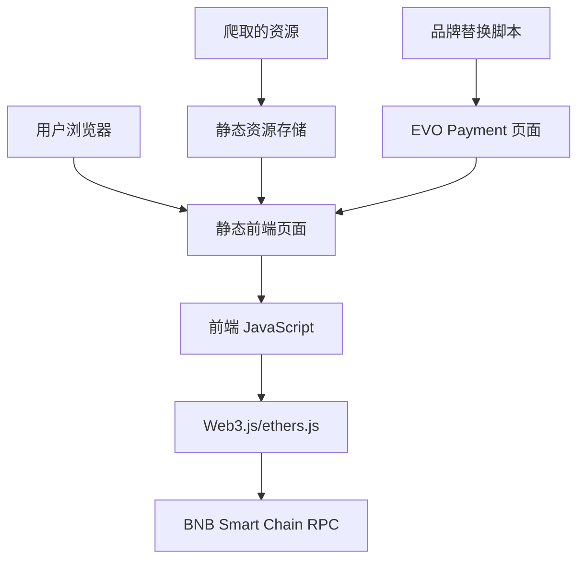

# 设计文档

## 概述

EVO Payment 克隆系统是一个基于 Web 的稳定币支付解决方案，通过复刻 imsafu.com 的用户界面并集成 BNB Smart Chain 区块链支付监听功能来实现。系统采用纯前端架构，使用现代 Web 技术栈，支持实时交易监听和自动支付确认。

## 架构

### 整体架构



### 技术栈

- **前端框架**: 纯 HTML5, CSS3, JavaScript (ES6+)
- **UI 框架**: Chakra UI (基于爬取的样式)
- **区块链交互**: Web3.js 或 ethers.js
- **样式处理**: CSS Modules + 自定义 CSS
- **构建工具**: 无需构建，直接静态文件服务
- **部署**: 静态文件服务器 (GitHub Pages, Netlify 等)

## 组件和接口

### 1. 页面复刻组件 (Page Replication Component)

**职责**: 复刻原始页面并进行品牌替换

**核心功能**:
- 像素级页面复刻
- 品牌元素替换 (文字、图片、颜色)
- 响应式布局保持
- 交互功能保留

**文件结构**:
```
demo/
├── index.html              # 首页 (商品选购)
├── payment.html            # 收银台页面
├── qrcode.html            # 二维码支付页面
├── success.html           # 支付成功页面
├── css/
│   ├── main.css           # 主样式文件
│   ├── chakra-ui.css      # Chakra UI 样式
│   └── responsive.css     # 响应式样式
├── js/
│   ├── main.js            # 主要 JavaScript 逻辑
│   ├── payment.js         # 支付处理逻辑
│   ├── blockchain.js      # 区块链交互
│   └── ui.js              # UI 交互逻辑
└── images/
    ├── logo.png           # EVO Payment 标志
    └── wallet_qr.jpg      # 固定二维码图片
```

### 2. 支付处理组件 (Payment Handler Component)

**职责**: 处理支付流程和状态管理

**核心功能**:
- 支付信息生成和管理
- 支付状态跟踪
- 用户输入验证
- 页面导航控制

**接口定义**:
```javascript
class PaymentHandler {
  // 生成支付会话
  createPaymentSession(productInfo) {
    return {
      paymentId: generateUUID(),
      amount: productInfo.price,
      currency: 'USD',
      product: productInfo.name,
      timestamp: Date.now(),
      status: 'pending'
    }
  }
  
  // 更新支付状态
  updatePaymentStatus(paymentId, status) {
    // 更新内存中的支付状态
  }
  
  // 获取支付信息
  getPaymentInfo(paymentId) {
    // 从内存中获取支付信息
  }
}
```

### 3. 区块链监听组件 (Blockchain Monitor Component)

**职责**: 监听 BNB Smart Chain 上的交易

**核心功能**:
- 连接 BSC 主网 RPC
- 轮询监听交易
- 交易验证和确认
- 实时状态更新

**接口定义**:
```javascript
class BlockchainMonitor {
  constructor(config) {
    this.rpcUrl = config.rpcUrl
    this.web3 = new Web3(this.rpcUrl)
    this.pollingInterval = config.pollingInterval || 5000
  }
  
  // 开始监听支付
  async startMonitoring(paymentInfo) {
    const { amount, tokenContract } = paymentInfo
    const receiverAddress = '0xe27577B0e3920cE35f100f66430de0108cb78a04' // 固定收款地址
    
    this.intervalId = setInterval(async () => {
      const isConfirmed = await this.checkPayment(
        receiverAddress, 
        amount, 
        tokenContract
      )
      
      if (isConfirmed) {
        this.onPaymentConfirmed(paymentInfo)
      }
    }, this.pollingInterval)
  }
  
  // 检查支付状态
  async checkPayment(address, expectedAmount, tokenContract) {
    // 查询区块链交易记录
    // 验证金额和代币合约
    // 返回确认状态
  }
  
  // 停止监听
  stopMonitoring() {
    if (this.intervalId) {
      clearInterval(this.intervalId)
    }
  }
}
```

### 4. 用户界面组件 (UI Component)

**职责**: 管理用户界面交互和状态显示

**核心功能**:
- 页面导航和路由
- 动态内容更新
- 用户反馈显示
- 响应式交互

**接口定义**:
```javascript
class PaymentUI {
  // 显示商品选择页面
  showProductSelection() {
    // 渲染商品列表
    // 绑定支付按钮事件
  }
  
  // 显示收银台页面
  showCashierPage(paymentInfo) {
    // 显示支付方式选择
    // 显示网络选择
    // 处理下拉框交互
  }
  
  // 显示二维码页面
  showQRCodePage(paymentInfo) {
    // 显示固定二维码图片
    // 显示支付详情
    // 开始支付监听
  }
  
  // 更新支付状态
  updatePaymentStatus(status, message) {
    // 更新状态指示器
    // 显示进度信息
  }
  
  // 显示成功页面
  showSuccessPage() {
    // 跳转到成功页面
    // 显示成功信息
  }
}
```

## 数据模型

### 支付会话模型 (Payment Session)

```javascript
const PaymentSession = {
  paymentId: String,           // 支付唯一标识
  productName: String,         // 商品名称
  amount: Number,              // 支付金额 (USD)
  selectedToken: String,       // 选择的代币 (USDT/USDC/BUSD)
  selectedNetwork: String,     // 选择的网络 (BSC)
  receiverAddress: String,     // 收款地址
  status: String,              // 支付状态
  createdAt: Date,            // 创建时间
  expiresAt: Date,            // 过期时间
  txHash: String              // 交易哈希 (确认后)
}
```

### 支付状态枚举

```javascript
const PaymentStatus = {
  PENDING: 'pending',          // 等待用户选择
  WAITING: 'waiting',          // 等待支付
  MONITORING: 'monitoring',    // 监听中
  CONFIRMED: 'confirmed',      // 已确认
  COMPLETED: 'completed',      // 已完成
  EXPIRED: 'expired',          // 已过期
  FAILED: 'failed'            // 支付失败
}
```

### 代币配置

```javascript
const SUPPORTED_TOKENS = {
  USDT: {
    symbol: 'USDT',
    name: 'Tether USD',
    contract: '0x55d398326f99059fF775485246999027B3197955',
    decimals: 18,
    icon: 'usdt-icon.png'
  },
  USDC: {
    symbol: 'USDC',
    name: 'USD Coin',
    contract: '0x8AC76a51cc950d9822D68b83fE1Ad97B32Cd580d',
    decimals: 18,
    icon: 'usdc-icon.png'
  },
  BUSD: {
    symbol: 'BUSD',
    name: 'Binance USD',
    contract: '0xe9e7CEA3DedcA5984780Bafc599bD69ADd087D56',
    decimals: 18,
    icon: 'busd-icon.png'
  }
}

const NETWORK_CONFIG = {
  BSC: {
    name: 'BNB Smart Chain',
    chainId: 56,
    rpcUrl: 'https://bsc-dataseed1.binance.org/',
    blockExplorer: 'https://bscscan.com'
  }
}

// 固定收款地址配置
const PAYMENT_CONFIG = {
  receiverAddress: '0xe27577B0e3920cE35f100f66430de0108cb78a04', // 固定收款钱包地址
  qrCodeImage: './images/wallet_qr.jpg' // 固定二维码图片路径
}
```

## 错误处理

### 错误类型定义

1. **网络错误** (NetworkError)
   - RPC 连接失败
   - 请求超时
   - 网络不可用

2. **支付错误** (PaymentError)
   - 金额验证失败
   - 代币合约错误
   - 交易确认超时

3. **用户界面错误** (UIError)
   - 页面加载失败
   - 用户输入无效
   - 浏览器兼容性问题

### 错误处理策略

```javascript
class ErrorHandler {
  static handleError(error, context) {
    console.error(`Error in ${context}:`, error)
    
    switch (error.type) {
      case 'NetworkError':
        this.showNetworkError()
        break
      case 'PaymentError':
        this.showPaymentError(error.message)
        break
      case 'UIError':
        this.showUIError(error.message)
        break
      default:
        this.showGenericError()
    }
  }
  
  static showNetworkError() {
    alert('Network connection failed. Please check your internet connection and try again.')
  }
  
  static showPaymentError(message) {
    alert(`Payment error: ${message}. Please try again or contact support.`)
  }
}
```

## 测试策略

### 功能测试

1. **页面复刻测试**
   - 视觉对比测试 (与原网站对比)
   - 响应式布局测试
   - 品牌替换验证

2. **支付流程测试**
   - 完整支付流程测试
   - 用户交互测试
   - 状态转换测试

3. **区块链集成测试**
   - BSC 主网连接测试
   - 交易监听测试
   - 支付确认测试

### 兼容性测试

- **浏览器兼容性**: Chrome, Safari (桌面版)
- **设备兼容性**: 桌面设备
- **网络环境**: 快速网络、慢速网络

## 部署和配置

### 环境配置

```javascript
// config.js - 配置文件
const CONFIG = {
  // 区块链配置
  blockchain: {
    rpcUrl: 'https://bsc-dataseed1.binance.org/',
    chainId: 56,
    confirmations: 3,
    pollingInterval: 5000
  },
  
  // 支付配置
  payment: {
    receiverAddress: '0xe27577B0e3920cE35f100f66430de0108cb78a04', // 固定收款地址
    supportedTokens: ['USDT', 'USDC', 'BUSD'],
    paymentTimeout: 30 * 60 * 1000, // 30分钟
    qrCodeImage: './images/wallet_qr.jpg' // 固定二维码图片
  },
  
  // UI 配置
  ui: {
    brand: 'EVO Payment',
    logo: './images/logo.png',
    theme: {
      primaryColor: '#2328da',
      backgroundColor: '#f4d8a9'
    }
  }
}
```

### Docker 部署架构

使用 Docker 容器化部署，提供一致的运行环境和简化的部署流程。

**Docker 配置**:
```dockerfile
# Dockerfile
FROM nginx:alpine

# 复制静态文件到 nginx 默认目录
COPY demo/ /usr/share/nginx/html/

# 复制 nginx 配置文件
COPY nginx.conf /etc/nginx/nginx.conf

# 暴露端口
EXPOSE 80 443

# 启动 nginx
CMD ["nginx", "-g", "daemon off;"]
```

**Nginx 配置**:
```nginx
# nginx.conf
events {
    worker_connections 1024;
}

http {
    include       /etc/nginx/mime.types;
    default_type  application/octet-stream;
    
    server {
        listen 80;
        server_name localhost;
        
        # 启用 gzip 压缩
        gzip on;
        gzip_types text/css application/javascript application/json;
        
        # 静态文件服务
        location / {
            root /usr/share/nginx/html;
            index index.html;
            try_files $uri $uri/ /index.html;
        }
        
        # 缓存静态资源
        location ~* \.(css|js|png|jpg|jpeg|gif|ico|svg)$ {
            expires 1y;
            add_header Cache-Control "public, immutable";
        }
        
        # 安全头部
        add_header X-Frame-Options "SAMEORIGIN" always;
        add_header X-Content-Type-Options "nosniff" always;
        add_header X-XSS-Protection "1; mode=block" always;
    }
}
```

**Docker Compose 配置**:
```yaml
# docker-compose.yml
version: '3.8'

services:
  evo-payment:
    build: .
    ports:
      - "8080:80"
      - "8443:443"
    volumes:
      - ./demo:/usr/share/nginx/html:ro
      - ./nginx.conf:/etc/nginx/nginx.conf:ro
    restart: unless-stopped
    environment:
      - NGINX_HOST=localhost
      - NGINX_PORT=80
```

### 部署流程

1. **构建 Docker 镜像**:
```bash
docker build -t evo-payment .
```

2. **运行容器**:
```bash
docker run -d -p 8080:80 --name evo-payment-app evo-payment
```

3. **使用 Docker Compose**:
```bash
docker-compose up -d
```

4. **HTTPS 配置** (生产环境):
```bash
# 使用 Let's Encrypt 证书
docker run -d \
  --name evo-payment-ssl \
  -p 80:80 -p 443:443 \
  -v /path/to/ssl:/etc/nginx/ssl \
  evo-payment
```

### 文件组织

```
project/
├── Dockerfile              # Docker 构建文件
├── docker-compose.yml      # Docker Compose 配置
├── nginx.conf              # Nginx 配置文件
├── demo/                   # 应用文件目录
│   ├── index.html          # 入口页面
│   ├── payment.html        # 收银台页面
│   ├── qrcode.html         # 二维码页面
│   ├── success.html        # 成功页面
│   ├── config.js           # 配置文件
│   ├── css/                # 样式文件
│   ├── js/                 # JavaScript 文件
│   ├── images/             # 图片资源
│   └── lib/                # 第三方库
│       ├── web3.min.js     # Web3.js 库
│       └── qrcode.min.js   # 二维码生成库
└── ssl/                    # SSL 证书目录 (可选)
    ├── cert.pem
    └── key.pem
```

### 部署优势

1. **环境一致性**: Docker 确保开发和生产环境一致
2. **快速部署**: 一键构建和部署
3. **易于扩展**: 支持水平扩展和负载均衡
4. **资源隔离**: 容器化提供良好的资源隔离
5. **版本管理**: 支持镜像版本管理和回滚