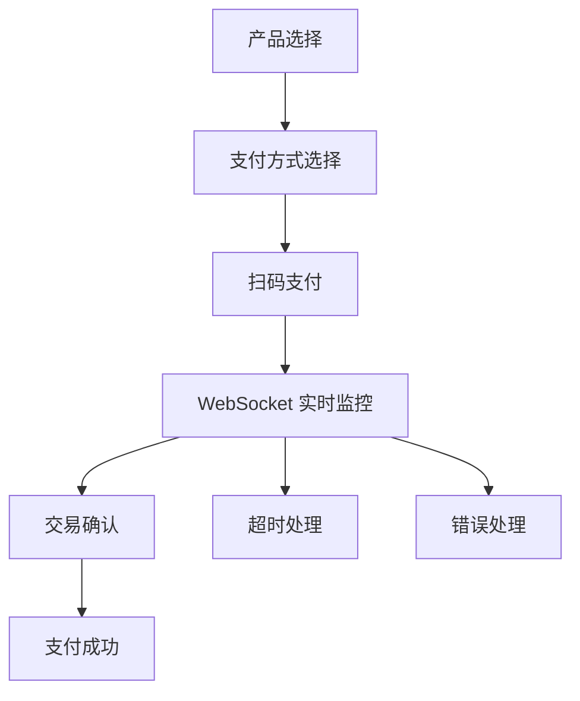
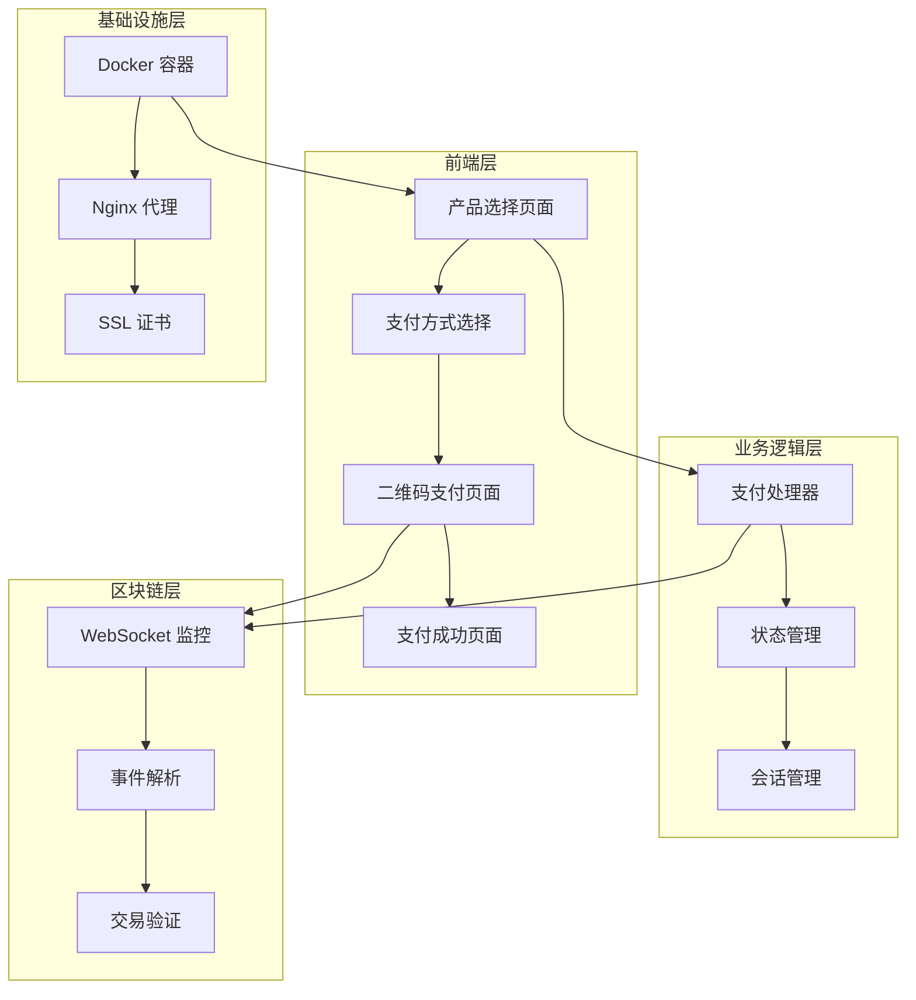
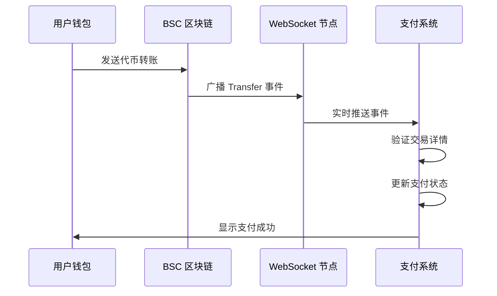
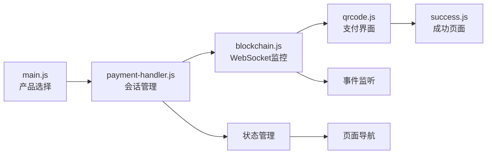

# 🪙 Stable Coin - 现代化 Web3 支付系统

[](LICENSE)
[](https://docker.com)
[](https://bscscan.com)
[](https://developer.mozilla.org/en-US/docs/Web/API/WebSocket)

一个完整的去中心化加密货币支付解决方案，支持多种稳定币支付，基于 BNB Smart Chain 区块链技术，采用 WebSocket 实时监控。

## ✨ 核心特性

### 🚀 技术亮点
- **🔌 WebSocket 实时监控**: 替代传统轮询，真正的实时交易检测
- **⚡ 零后端架构**: 纯前端 + 区块链，无需服务器维护
- **🔄 智能故障转移**: 多 RPC 端点自动切换，确保服务可用性
- **📱 响应式设计**: 完美支持桌面和移动设备
- **🛡️ 安全可靠**: 基于区块链的透明交易，资金安全有保障

### 💳 支付体验
- **直观的支付流程**: 产品选择 → 支付方式 → 扫码支付 → 成功确认
- **多币种支持**: USDT、USDC、USDC.e、BUSD、TUSD
- **实时状态更新**: 支付状态实时监控和用户反馈
- **智能超时管理**: 30分钟支付窗口，自动过期处理

### 🏗️ 技术架构
- **前端**: HTML5 + CSS3 + Vanilla JavaScript
- **区块链**: Web3.js + BNB Smart Chain (BSC)
- **监控**: WebSocket 实时事件监听
- **部署**: Docker + Nginx + Let's Encrypt SSL
- **样式**: 基于 Chakra UI 设计系统

### 🎯 应用场景
- 🎁 **慈善捐赠**: 透明的慈善捐款平台
- 🛒 **电商支付**: 支持加密货币的在线商店  
- 💰 **众筹平台**: 去中心化的项目众筹
- 🎮 **游戏内购**: 区块链游戏的道具购买
- 📱 **数字服务**: SaaS 产品的加密货币订阅

## 📚 目录

- [🚀 快速开始](#-快速开始)
- [💳 支付流程](#-支付流程)
- [🔗 区块链集成](#-区块链集成)
- [📁 项目结构](#-项目结构)
- [⚙️ 配置说明](#️-配置说明)
- [🛠️ 开发指南](#️-开发指南)
- [🚀 生产环境部署](#-生产环境部署)
- [🔧 故障排除](#-故障排除)
- [📊 性能监控](#-性能监控)

## 🚀 快速开始

### 🐳 方式一：Docker Compose 部署（推荐）

```bash
# 克隆项目
git clone <repository-url>
cd demo/deploy

# 一键启动
docker-compose up -d

# 查看运行状态
docker-compose ps

# 访问应用
open http://localhost:8080
```

### ⚡ 方式二：开发模式

```bash
# 进入项目目录
cd demo

# 使用 Python 启动静态服务器
python3 -m http.server 8080

# 或使用 Node.js
npx http-server -p 8080

# 访问应用
open http://localhost:8080
```

### 🌐 方式三：生产环境部署

```bash
# 完整部署（包含 SSL 证书申请）
./deploy/deploy.sh ubuntu@your-ec2-ip your-domain.com ~/.ssh/key.pem your-email@example.com

# 快速更新（跳过镜像构建）
./deploy/deploy.sh ubuntu@your-ec2-ip your-domain.com ~/.ssh/key.pem your-email@example.com false
```

## 💳 支付流程

### 🔄 完整支付体验



### 1️⃣ 产品选择页面
- 🥜 **多样化产品**: 花生($1) → 大米($5) → 面包($10) → 牛奶($20) → 苹果($30)
- 📱 **响应式界面**: 完美适配桌面和移动设备
- 🎨 **直观设计**: 清晰的产品展示和价格标识

### 2️⃣ 支付方式选择页面
- 💰 **多币种支持**: USDT、USDC、USDC.e、BUSD、TUSD
- 🌐 **网络选择**: BNB Smart Chain (BSC) 主网
- ⏰ **智能倒计时**: 30分钟支付窗口，实时倒计时显示
- 🆔 **支付追踪**: 唯一支付 ID 生成和管理

### 3️⃣ 二维码支付页面
- 📱 **扫码支付**: 高清二维码，支持所有主流钱包
- 📋 **地址复制**: 一键复制收款地址
- 🔌 **WebSocket 监控**: 实时监听区块链交易
- 📊 **状态指示器**: 连接状态、监控进度实时显示
- 🛠️ **调试工具**: 内置开发者调试面板

### 4️⃣ 支付成功页面
- ✅ **确认信息**: 完整的支付详情展示
- 🔗 **区块链信息**: 交易哈希、区块号等详细信息
- 📄 **交易记录**: 可展开的区块链详情面板
- 🏠 **导航选项**: 返回首页或发起新支付

## ⚙️ 配置说明

### 🔧 主配置文件 `config.js`

```javascript
const CONFIG = {
  // 🔗 区块链配置
  blockchain: {
    rpcUrl: 'https://bsc-dataseed1.binance.org/',
    chainId: 56,                    // BSC 主网
    confirmations: 1                // WebSocket 版本只需 1 个确认
  },
  
  // 💳 支付配置
  payment: {
    receiverAddress: '0xe27577B0e3920cE35f100f66430de0108cb78a04',
    supportedTokens: ['USDT', 'USDC', 'USDC.e', 'BUSD', 'TUSD'],
    paymentTimeout: 30 * 60 * 1000, // 30分钟超时
    qrCodeImage: './images/wallet_qr.jpg'
  },
  
  // 🪙 代币合约配置
  tokens: {
    USDT: {
      symbol: 'USDT',
      name: 'Tether USD',
      contract: '0x55d398326f99059fF775485246999027B3197955',
      decimals: 18
    },
    USDC: {
      symbol: 'USDC', 
      name: 'USD Coin',
      contract: '0x8AC76a51cc950d9822D68b83fE1Ad97B32Cd580d',
      decimals: 18
    }
    // ... 更多代币配置
  },
  
  // 🌐 网络配置
  networks: {
    BSC: {
      name: 'BNB Smart Chain',
      chainId: 56,
      rpcUrl: 'https://bsc-dataseed1.binance.org/',
      blockExplorer: 'https://bscscan.com'
    }
  }
};
```

### 🔑 关键配置项

| 配置项 | 说明 | 默认值 |
|--------|------|--------|
| **收款地址** | 固定的 BSC 钱包地址 | `0xe27577B0e3920cE35f100f66430de0108cb78a04` |
| **支持代币** | 支持的稳定币类型 | USDT, USDC, USDC.e, BUSD, TUSD |
| **网络设置** | BNB Smart Chain 主网 | Chain ID: 56 |
| **超时设置** | 支付会话自动过期时间 | 30 分钟 |
| **确认数** | 交易确认要求 | 1 个区块确认 |

### 🔌 WebSocket 端点配置

```javascript
const WEBSOCKET_CONFIG = {
  endpoints: [
    {
      url: 'wss://bsc-ws-node.nariox.org/',
      priority: 1,
      timeout: 5000,
      name: 'Nariox BSC Node'
    },
    {
      url: 'wss://bsc.publicnode.com/',
      priority: 2,
      timeout: 5000, 
      name: 'Public Node BSC'
    }
  ],
  
  connectionStrategy: {
    reconnectInterval: 5000,
    maxReconnectAttempts: 3,
    connectionTimeout: 10000
  },
  
  heartbeatInterval: 30000
};
```

## 📁 项目结构

```
demo/
├── 📄 核心页面
│   ├── index.html              # 🏠 首页（产品选择）
│   ├── payment.html            # 💳 支付方式选择页面
│   ├── qrcode.html            # 📱 二维码支付页面
│   └── success.html           # ✅ 支付成功页面
│
├── ⚙️ 配置文件
│   ├── config.js              # 🔧 应用主配置
│   └── .dockerignore          # 🐳 Docker 忽略文件
│
├── 🎨 样式文件
│   └── css/
│       ├── main.css           # 🎨 主样式文件
│       ├── payment.css        # 💳 支付页面样式
│       ├── qrcode.css         # 📱 二维码页面样式
│       └── success.css        # ✅ 成功页面样式
│
├── 💻 JavaScript 模块
│   └── js/
│       ├── main.js            # 🏠 主页面逻辑
│       ├── payment.js         # 💳 支付页面逻辑
│       ├── qrcode.js          # 📱 二维码页面逻辑
│       ├── success.js         # ✅ 成功页面逻辑
│       ├── payment-handler.js # 🔄 支付会话管理
│       └── blockchain.js      # 🔗 区块链集成 (WebSocket)
│
├── 🖼️ 资源文件
│   ├── images/
│   │   ├── logo.png           # 🏷️ 应用 Logo
│   │   ├── avatar_circular.png # 👤 用户头像
│   │   └── wallet_qr.jpg      # 📱 钱包二维码
│   └── lib/
│       └── web3.min.js        # 🌐 Web3.js 库
│
├── 🐳 部署配置
│   └── deploy/
│       ├── Dockerfile         # 🐳 Docker 镜像构建
│       ├── docker-compose.yml # 🐙 Docker Compose 配置
│       ├── nginx.conf         # 🌐 Nginx 服务器配置
│       ├── docker-entrypoint.sh # 🚀 容器启动脚本
│       ├── deploy.sh          # 🚀 主部署脚本
│       └── cache-manager.sh   # 📦 缓存管理脚本
│
└── 📋 运行时文件
    ├── logs/                  # 📝 应用日志
    └── ssl/                   # 🔒 SSL 证书
```

### 🏗️ 架构设计



## 💳 支付流程

### 1. 产品选择页面（index.html）
- 🥜 选择捐赠产品（花生 $1.00 - 大米 $5.00）
- 📝 显示捐赠信息和团队头像
- 🔘 点击 "Pay With Stable Coin" 按钮

### 2. 支付方式选择页面（payment-ws.html）
- 💰 **选择代币**: USDT、USDC、USDC.e、BUSD、TUSD
- 🌐 **选择网络**: BNB Smart Chain（BSC）
- ⏰ 显示支付 ID 和过期时间倒计时
- ✅ 点击 "Continue to Payment" 进入下一步

### 3. 二维码支付页面（qrcode-ws.html）
- 📱 显示钱包地址二维码
- 📋 可复制的钱包地址
- 📊 实时支付状态监控
- 🔄 区块链交易确认进度
- 🛠️ 内置调试工具面板

### 4. 支付成功页面（success-ws.html）
- ✅ 支付确认信息
- 📄 交易详情摘要
- 🔗 区块链浏览器链接
- 🏠 返回首页或新建支付

### 🔄 支付状态管理

```javascript
const PaymentStatus = {
    PENDING: 'pending',      // 🟡 等待用户选择
    WAITING: 'waiting',      // 🟠 等待支付
    MONITORING: 'monitoring', // 🔵 WebSocket 监听中
    CONFIRMED: 'confirmed',   // 🟢 交易已确认
    COMPLETED: 'completed',   // ✅ 支付已完成
    EXPIRED: 'expired',      // ⏰ 支付已过期
    FAILED: 'failed'         // ❌ 支付失败
};
```

### ⚡ WebSocket 实时监控特性

- **🔌 智能连接管理**: 多端点自动故障转移
- **📡 事件订阅**: 直接监听 ERC-20 Transfer 事件
- **💓 心跳检测**: 自动检测连接健康状态
- **🔄 自动重连**: 连接断开时智能重连
- **📊 性能监控**: 实时监控延迟、消息数量等指标

## 🔗 区块链集成

### 🌐 网络配置
- **主网**: BNB Smart Chain (BSC)
- **Chain ID**: 56
- **收款地址**: `0xe27577B0e3920cE35f100f66430de0108cb78a04`
- **区块浏览器**: [BSCScan](https://bscscan.com)

### 💰 支持的代币

| 代币 | 合约地址 | 精度 | 状态 |
|------|----------|------|------|
| USDT | `0x55d398326f99059fF775485246999027B3197955` | 18 | ✅ 活跃 |
| USDC | `0x8AC76a51cc950d9822D68b83fE1Ad97B32Cd580d` | 18 | ✅ 活跃 |
| USDC.e | `0x8AC76a51cc950d9822D68b83fE1Ad97B32Cd580d` | 18 | ✅ 活跃 |
| BUSD | `0xe9e7CEA3DedcA5984780Bafc599bD69ADd087D56` | 18 | ✅ 活跃 |
| TUSD | `0x40af3827F39D0EAcBF4A168f8D4ee67c121D11c9` | 18 | ✅ 活跃 |

### 🔌 WebSocket 端点配置

```javascript
const WEBSOCKET_ENDPOINTS = [
  {
    url: 'wss://bsc-ws-node.nariox.org/',
    priority: 1,
    name: 'Nariox BSC Node'
  },
  {
    url: 'wss://bsc.publicnode.com/',
    priority: 2, 
    name: 'Public Node BSC'
  },
  {
    url: 'wss://bsc-dataseed1.binance.org/ws/',
    priority: 3,
    name: 'Binance BSC DataSeed'
  }
];
```

### ⚡ 实时监控特性

- **🎯 精准监听**: 直接订阅 Transfer 事件，避免无效轮询
- **🔄 智能切换**: 多端点自动故障转移，确保服务可用性
- **💓 健康检查**: 心跳机制监控连接状态
- **📊 性能优化**: 智能延迟和连接质量监控
- **🛡️ 错误恢复**: 完善的错误处理和自动重试机制

### 🔍 交易检测流程



## 🛠️ 开发指南

### 🚀 本地开发环境

```bash
# 1. 克隆项目
git clone <repository-url>
cd demo

# 2. 启动开发服务器
python3 -m http.server 8080
# 或使用 Node.js
npx http-server -p 8080

# 3. 访问应用
open http://localhost:8080
```

### 🏗️ 代码架构

#### 核心模块设计



#### 关键模块详解

**🔄 支付处理器 (`payment-handler.js`)**
```javascript
// 创建支付会话
const session = paymentHandler.createPaymentSession({
  product: 'peanut',
  price: 1.00,
  currency: 'USD'
});

// 更新支付状态  
paymentHandler.updatePaymentSession(paymentId, { 
  status: 'confirmed',
  txHash: '0x...'
});

// 页面导航
paymentHandler.navigateToPage('success', paymentId);
```

**🔗 区块链管理器 (`blockchain.js`)**
```javascript
// WebSocket 连接管理
const monitor = new WebSocketMonitor();
await monitor.connect();

// 订阅 Transfer 事件
monitor.subscribeToTransferEvents();

// 处理支付检测
monitor.onPaymentDetected((paymentData) => {
  console.log('Payment detected:', paymentData);
});
```

### 🛠️ 调试工具

#### 内置调试面板功能

| 功能 | 描述 | 用途 |
|------|------|------|
| 🧪 **快速测试** | 模拟支付成功 | 无需真实转账测试流程 |
| 🔌 **WebSocket 控制** | 连接/断开监控 | 测试连接状态和重连 |
| 📊 **性能监控** | 显示连接质量 | 监控延迟和消息数量 |
| 🌐 **端点状态** | 显示所有端点健康状态 | 诊断连接问题 |

#### 开发者控制台

```javascript
// 全局可用对象
window.paymentHandler    // 支付会话管理
window.blockchainMonitor // WebSocket 区块链监控  
window.CONFIG           // 应用配置
window.PaymentStatus    // 支付状态枚举

// 调试命令示例
paymentHandler.getCurrentPayment()        // 查看当前支付
blockchainMonitor.getEndpointHealth()    // 查看端点健康状态
blockchainMonitor.getConnectionQuality() // 查看连接质量
```

### ⚙️ 自定义配置

#### 修改收款地址
```javascript
// config.js
payment: {
  receiverAddress: '0x你的钱包地址',
  qrCodeImage: './images/your_qr.jpg'
}
```

#### 添加新代币支持
```javascript
// config.js  
tokens: {
  NEWTOKEN: {
    symbol: 'NEWTOKEN',
    name: 'New Token',
    contract: '0x合约地址',
    decimals: 18,
    icon: 'newtoken-icon.png'
  }
}
```

#### 调整 WebSocket 配置
```javascript
// blockchain.js 中的 WEBSOCKET_CONFIG
endpoints: [
  {
    url: 'wss://your-custom-endpoint.com/',
    priority: 1,
    timeout: 5000,
    name: 'Custom Endpoint'
  }
]
```

### 🧪 测试流程

#### 完整测试步骤

1. **产品选择测试**
   ```bash
   # 访问首页，测试产品选择
   open http://localhost:8080
   ```

2. **支付流程测试**
   ```bash
   # 使用调试面板快速测试
   # 1. 选择产品 → 2. 选择支付方式 → 3. 点击调试面板"快速测试"
   ```

3. **WebSocket 连接测试**
   ```javascript
   // 控制台测试 WebSocket 连接
   blockchainMonitor.connect().then(() => {
     console.log('WebSocket connected successfully');
   });
   ```

4. **真实支付测试**
   ```bash
   # 使用测试网络或小额真实转账测试
   # 确保钱包中有少量 BSC 测试币
   ```

### 📊 性能优化

#### 前端优化
- ✅ 启用浏览器缓存
- ✅ 压缩静态资源
- ✅ 使用 CDN 加速（可选）

#### WebSocket 优化
- ✅ 智能端点选择
- ✅ 连接质量监控
- ✅ 自动重连机制
- ✅ 心跳检测

## 🚀 生产环境部署

### ⚡ 一键部署方案

#### 🎯 一键部署（推荐）

**智能检测，自动 SSL，完整自动化部署流程**

```bash
# 完整部署（包含 SSL 证书自动生成）
./deploy/deploy.sh ubuntu@your-ec2-ip your-domain.com ~/.ssh/key.pem your-email@example.com

# 仅 HTTP 模式（不申请 SSL 证书）
./deploy/deploy.sh ubuntu@your-ec2-ip your-domain.com ~/.ssh/key.pem temp@example.com
```

**🚀 自动化流程：**
1. ✅ **环境预检查** - 域名解析、SSH 连接验证
2. 🔨 **本地构建** - 一体化 Docker 镜像构建
3. 📤 **镜像推送** - 自动推送到远程服务器
4. 🛠️ **依赖安装** - 自动安装 Docker、certbot 等
5. 🔒 **SSL 证书** - Let's Encrypt 自动申请和配置
6. 🌐 **智能启动** - 自动选择 HTTP/HTTPS 配置
7. ⏰ **证书续期** - 自动设置证书续期任务
8. ✅ **健康检查** - 服务状态验证

#### ⚡ 快速更新部署

**利用缓存机制，构建时间减少 80%+**

```bash
# 快速更新（跳过镜像构建）
./deploy/deploy.sh ubuntu@your-ec2-ip your-domain.com ~/.ssh/key.pem your-email@example.com false
```

**🔄 更新流程：**
1. ⚡ **缓存构建** - 利用基础镜像缓存（10-30秒）
2. 📦 **增量推送** - 仅推送变更内容
3. 🔄 **零停机更新** - 滚动更新服务
4. ✅ **自动验证** - 健康检查确认

#### 📊 性能对比

| 部署方式 | 首次部署 | 后续更新 | 特点 |
|----------|----------|----------|------|
| 🐌 **传统方式** | 10-15分钟 | 5-10分钟 | 每次重新下载依赖 |
| ⚡ **优化部署** | 3-5分钟 | 1-2分钟 | 智能缓存，增量更新 |
| 🚀 **一键部署** | 2-3分钟 | 30-60秒 | 全自动化，零配置 |

## AWS EC2 部署

### 🚀 方式1: 完整自动化部署 (推荐)

**智能检测，自动配置SSL，一键搞定所有**：

```bash
# 完整部署 (包含SSL证书自动生成)
./deploy/deploy.sh ubuntu@your-ec2-ip your-domain.com ~/.ssh/your-key.pem your-email@example.com

# HTTP模式部署
./deploy/deploy.sh ubuntu@your-ec2-ip your-domain.com ~/.ssh/your-key.pem temp@example.com

# 自动完成：
# - 环境预检查和依赖安装
# - 智能镜像构建和缓存优化
# - 推送镜像到远程服务器
# - 自动生成Let's Encrypt SSL证书
# - 智能启动应用 (自动选择HTTP/HTTPS)
# - 设置证书自动续期和健康检查
```

**🎯 智能特性:**
- ✅ 多阶段构建优化，构建时间减少80%+
- ✅ 智能SSL证书检测和自动申请
- ✅ 动态HTTP/HTTPS配置切换
- ✅ 完整的健康检查和状态监控
- ✅ 自动证书续期和缓存管理

### 方式2: 快速更新部署

**利用缓存机制，快速更新应用代码**：

```bash
# 快速更新 (跳过镜像构建，直接部署)
./deploy/deploy.sh ubuntu@your-ec2-ip your-domain.com ~/.ssh/your-key.pem your-email@example.com false

# 适用场景：
# - 配置文件更新
# - SSL证书续期
# - 服务重启维护
```

**特性:**
- ✅ 跳过镜像构建，部署时间减少90%+
- ✅ 保留现有镜像和配置
- ✅ 适合频繁的配置更新
- ✅ 零停机滚动更新

### 方式2: 手动分步部署

如需更精细的控制，可以手动执行各个步骤：

```bash
# 1. 本地构建镜像
cd demo
docker build -f deploy/Dockerfile -t evo-payment:$(date +%Y%m%d-%H%M%S) .

# 2. 导出和传输镜像
docker save evo-payment:latest | gzip > evo-payment.tar.gz
scp -i ~/.ssh/your-key.pem evo-payment.tar.gz ubuntu@your-ec2-ip:/tmp/

# 3. 在服务器上部署
ssh -i ~/.ssh/your-key.pem ubuntu@your-ec2-ip
cd /tmp && gunzip evo-payment.tar.gz && docker load -i evo-payment.tar

# 4. 配置和启动服务
mkdir -p /opt/evo-payment && cd /opt/evo-payment
# 手动配置 docker-compose.yml 和 SSL 证书
docker-compose up -d
```

### 手动部署步骤

如果需要完全手动控制部署过程：

#### 1. 服务器环境准备
```bash
# SSH 连接到服务器
ssh -i ~/.ssh/your-key.pem ubuntu@your-ec2-ip

# 安装 Docker 和 Docker Compose
sudo apt update
sudo apt install -y docker.io docker-compose
sudo usermod -aG docker $USER

# 安装 certbot (用于 SSL 证书)
sudo apt install -y certbot
```

#### 2. SSL 证书配置 (可选)

**Let's Encrypt 免费证书:**
```bash
# 申请证书
sudo certbot certonly --standalone -d your-domain.com --email your-email@example.com

# 复制证书到工作目录
mkdir -p /opt/evo-payment/ssl
sudo cp /etc/letsencrypt/live/your-domain.com/fullchain.pem /opt/evo-payment/ssl/cert.pem
sudo cp /etc/letsencrypt/live/your-domain.com/privkey.pem /opt/evo-payment/ssl/key.pem
sudo chown $USER:$USER /opt/evo-payment/ssl/*.pem
```

#### 3. 部署应用
```bash
# 使用主部署脚本
cd demo
./deploy/deploy.sh ubuntu@your-ec2-ip your-domain.com ~/.ssh/your-key.pem your-email@example.com
```

#### 4. 服务管理
```bash
# SSH 到服务器后，在 /opt/evo-payment 目录下
./manage.sh status    # 查看状态
./manage.sh logs      # 查看日志  
./manage.sh restart   # 重启服务
./manage.sh ssl-renew # SSL证书续期
```

### 证书管理

**Let's Encrypt 证书自动续期:**
- 部署时自动设置 cron 任务
- 手动续期: `./manage.sh ssl-renew` (在服务器 /opt/evo-payment 目录下)

### 🏭 生产环境特性

#### 🌐 Nginx 优化配置
- ✅ **Gzip 压缩** - 减少传输大小 70%+
- ✅ **静态缓存** - 浏览器缓存优化
- ✅ **安全头部** - HSTS、CSP、XSS 防护
- ✅ **负载均衡** - 支持多实例部署

#### 🔒 SSL/TLS 安全
- ✅ **Let's Encrypt** - 免费 SSL 证书自动申请
- ✅ **自动续期** - 证书到期前自动续期
- ✅ **HTTPS 重定向** - 强制 HTTPS 访问
- ✅ **现代加密** - TLS 1.2+ 支持

#### 📊 监控和日志
- ✅ **健康检查** - 自动服务状态监控
- ✅ **访问日志** - Nginx 访问日志记录
- ✅ **错误日志** - 详细错误信息记录
- ✅ **日志轮转** - 自动日志文件管理

#### 🐳 容器化优势
- ✅ **一致性环境** - 开发、测试、生产环境一致
- ✅ **快速扩容** - 支持水平扩展
- ✅ **资源隔离** - 容器级别资源管理
- ✅ **版本管理** - 镜像版本控制和回滚

## 🔧 故障排除

### 常见问题

#### 1. 支付监控不工作
**症状**: 二维码页面无法检测到支付
**解决方案**:
```bash
# 检查 RPC 连接状态
打开调试面板 → "🌐 RPC Connection Status"

# 测试区块链连接
点击 "🔄 Refresh RPC Status"

# 切换 RPC 节点
点击 "🔄 Switch RPC"
```

#### 2. Docker 容器启动失败
**症状**: `docker-compose up` 报错
**解决方案**:
```bash
# 检查端口占用
lsof -i :8080
lsof -i :8443

# 清理旧容器
docker-compose down
docker system prune -f

# 重新构建
docker-compose build --no-cache
docker-compose up -d
```

#### 3. SSL 证书问题
**症状**: HTTPS 访问失败
**解决方案**:
```bash
# 检查证书状态
cd demo
./deploy/manage.sh ssl-check

# 手动续期证书
./deploy/manage.sh ssl-renew

# 重启服务
./deploy/manage.sh restart
```

#### 4. 区块链 RPC 限流
**症状**: 频繁出现 "rate limit" 错误
**解决方案**:
- 系统会自动切换到备用 RPC 节点
- 调整 `config.js` 中的 `pollingInterval` 增加间隔
- 使用调试面板暂停监控，手动刷新

### 开发环境检查清单

- [ ] **Docker**: 确保 Docker 和 Docker Compose 已安装
- [ ] **端口**: 确保 8080 和 8443 端口可用
- [ ] **网络**: 确保可以访问 BSC RPC 节点
- [ ] **浏览器**: 使用现代浏览器，启用 JavaScript
- [ ] **HTTPS**: 生产环境需要有效的 SSL 证书

### 性能优化建议

#### 前端优化
- 启用浏览器缓存
- 压缩静态资源
- 使用 CDN 加速

#### 区块链优化  
- 合理设置轮询间隔
- 使用多个 RPC 端点
- 实施智能重试机制

#### 服务器优化
- 配置 Nginx 缓存
- 启用 Gzip 压缩
- 设置适当的安全头部

### 监控和日志

#### 应用日志
```bash
# Docker 日志
docker-compose logs -f

# Nginx 访问日志
tail -f logs/access.log

# Nginx 错误日志  
tail -f logs/error.log
```

#### 区块链监控
```bash
# 在浏览器控制台
console.log(blockchainManager.getRpcStatus());
console.log(paymentHandler.getPaymentStats());
```

### 技术支持

如遇到问题，请提供以下信息：
1. **错误描述**: 详细的错误现象和重现步骤
2. **环境信息**: 操作系统、浏览器版本、Docker 版本
3. **日志信息**: 相关的错误日志和控制台输出
4. **配置信息**: `config.js` 中的相关配置（隐藏敏感信息）

## 📊 性能监控

### 🔍 实时监控指标

#### WebSocket 连接质量
```javascript
// 获取连接质量信息
const quality = blockchainMonitor.getConnectionQuality();
console.log('连接质量:', quality);

// 输出示例
{
  messagesReceived: 1250,
  averageLatency: 45,      // 毫秒
  connectionUptime: 3600,  // 秒
  blocksMissed: 0,
  lastMessageTime: 1640995200000
}
```

#### 支付系统统计
```javascript
// 获取支付统计
const stats = paymentHandler.getPaymentStats();
console.log('支付统计:', stats);

// 输出示例
{
  total: 156,
  completed: 142,
  failed: 8,
  expired: 6,
  websocketMode: 156,
  averageDetectionTime: 2.3 // 秒
}
```

### 📈 性能优化建议

#### 前端优化
- ✅ 启用浏览器缓存（Cache-Control: max-age=31536000）
- ✅ 压缩静态资源（Gzip 压缩率 70%+）
- ✅ 使用 CDN 加速（可选）
- ✅ 图片优化（WebP 格式支持）

#### WebSocket 优化
- ✅ 智能端点选择算法
- ✅ 连接质量实时监控
- ✅ 自动故障转移机制
- ✅ 心跳检测和重连策略

#### 服务器优化
- ✅ Nginx 工作进程优化
- ✅ 内存和 CPU 资源监控
- ✅ 日志文件自动轮转
- ✅ 系统资源使用率监控

---

## 🤝 贡献指南

### 🔧 开发环境设置
1. Fork 本项目
2. 创建功能分支：`git checkout -b feature/amazing-feature`
3. 提交更改：`git commit -m 'Add amazing feature'`
4. 推送分支：`git push origin feature/amazing-feature`
5. 提交 Pull Request

### 📝 代码规范
- 使用 ESLint 进行代码检查
- 遵循 JavaScript Standard Style
- 添加适当的注释和文档
- 确保所有测试通过

### 🐛 问题反馈
- 📧 **技术支持**: 提交 GitHub Issue
- 📖 **文档问题**: 查看 `deploy/DEPLOYMENT.md`
- 💬 **功能建议**: 欢迎提交 Feature Request

---

## 📄 许可证

本项目采用 MIT 许可证 - 查看 [LICENSE](LICENSE) 文件了解详情。

---

## ⭐ 致谢

感谢以下开源项目和服务：
- [Web3.js](https://web3js.readthedocs.io/) - 以太坊 JavaScript API
- [BNB Smart Chain](https://www.bnbchain.org/) - 高性能区块链网络
- [Docker](https://www.docker.com/) - 容器化平台
- [Nginx](https://nginx.org/) - 高性能 Web 服务器
- [Let's Encrypt](https://letsencrypt.org/) - 免费 SSL 证书

---

<div align="center">

**🌟 如果这个项目对你有帮助，请给它一个 Star！**

[](https://github.com/your-username/stable-coin-payment)

</div>